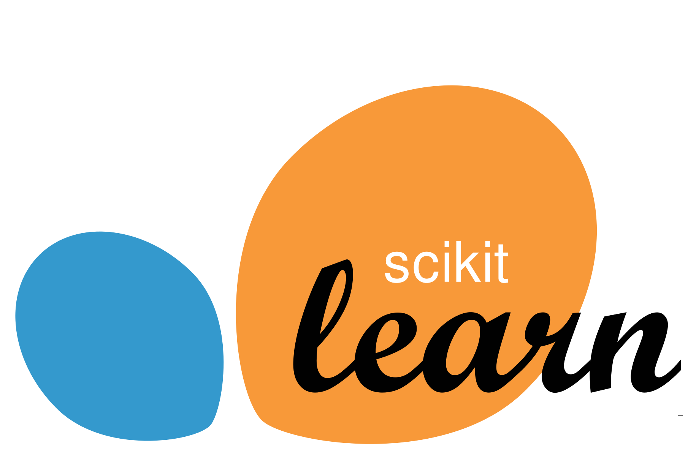

<h1 align="center"><b><i><em>Data Scientist</em></i> Roger   a tu servicio </b></h1>

<link rel="stylesheet" type='text/css' href="https://cdn.jsdelivr.net/gh/devicons/devicon@latest/devicon.min.css" />

   
  

## <b> Proyects</b>

<a href="https://github.com/RogerGuevara555/Proyectos-con-Python">
      		 
          </img>
    	</a>

## <b> Skills</b>

<table>
  <tr>
    <td align="center">
       
      <b>Python</b>
    </td>
    <td align="center">
       
      <b>Pandas</b>
    </td>
    <td align="center">
       
      <b>Matplotlib</b>
    </td>
    <td align="center">
       
      <b>Seaborn</b>
    </td>
    <td align="center">
       
      <b>Numpy</b>
    </td>
  </tr>

  <tr>
    <td align="center">
       
      <b>SQL</b>
    </td>
    <td align="center">
       
      <b>SQLite</b>
    </td>
    <td align="center">
       
      <b>PowerBi</b>
    </td>
    <td align="center">
       
      <b>ScikitLearn</b>
    </td>
    <td align="center">
       
      <b>TensorFlow</b>
    </td>
  </tr>

  <tr>
    <td align="center">
       
      <b>VSCode</b>
    </td>
    <td align="center">
       
      <b>Git</b>
    </td>
    <td align="center">
       
      <b>GitHub</b>
    </td>
    <td align="center"></td>
    <td align="center"></td>
    <td align="center"></td>
  </tr>
  
</table>

